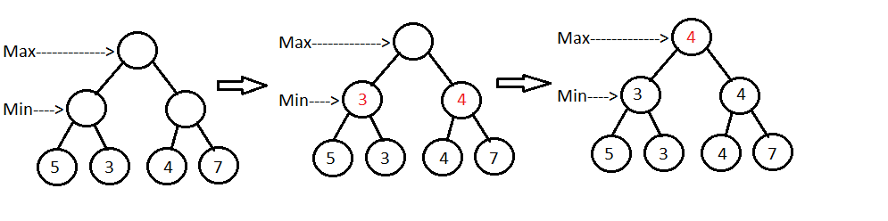

# Introduction
My goal for this project was to implement an AI that doesn't necessarily need to understand chess but tries to play chess against a human opponent. First I started to search
for an algorithm that predicts or even thinks. But it turns out that implementing like for example a neural network to actually teach it to play chess is way harder than it looks. 
So I settled with the minimax algorithm which is a algorithm that uses a binary tree depth search method.

# explaining the algorithm
Minimax is mostly used in zero-sum game theory. This means that the algorithm tries to minimze the opponen't maximum payoff. In zero-sum games this is Identical to minimzing one's own loss, and to maximizeing one's own minimum gain.

So take this Tree for example:

**Step1:** It is the minimum player its turn. So he goes through the tree and takes from every base branch the minimum value to the node parent node.

**Step2:** Now it is the player that represents the maximum's turn. As previous he checks al child nodes and now takes the maximums of its children.

So this is the basics of the minmax algorithm.

# Applying the algorithm on a chess board

To apply chess to the minimax algorithm we first need to determine some things. To begin with every piece needs a certain value. Because we are going to calculate our tree with the determined values for each piece. This is how we are going to know what the difference is between taking a pawn and taking a rook for example.
